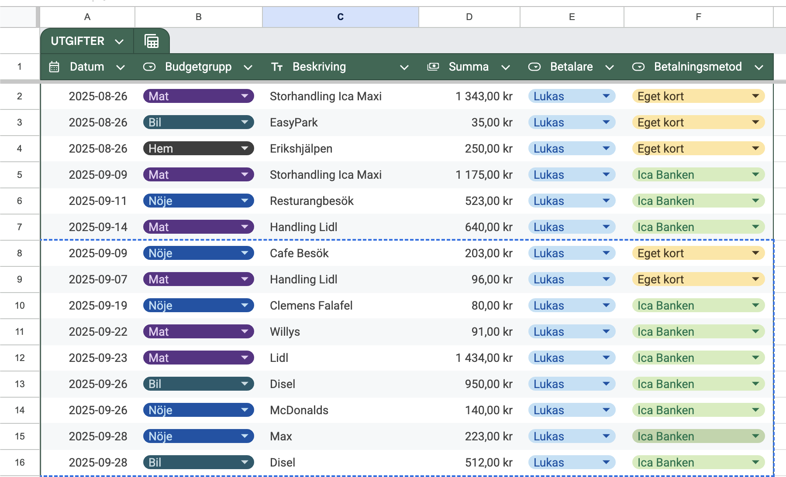

# Prästbyrån Kassa 🛒

Ett digitalt kassasystem byggt för konfirmationsläger för att hantera inköp i kiosken, saldo för deltagare (konfirmander/hjon) och produktlager.

Projektet är byggt med **React (Vite)** och använder **Firebase Firestore** som databas.

## ✨ Funktioner

* **Saldohantering:** Håller koll på varje deltagares saldo och köphistorik.
* **Köpgränser:** Automatisk spärr om en konfirmand försöker handla för mer än veckans gräns (100 kr/vecka).
* **Site Lock:** Hela appen är låst med en PIN-kod för att förhindra obehörig åtkomst på delade enheter.
* **Admin-läge:** Låst med knapptryckning. Möjlighet att lägga till/redigera produkter och hantera kunder direkt i gränssnittet.
* **Sökfunktion:** Snabbsök för att hitta kunder i listan.



## 🚀 Installation & Setup

För att köra detta projekt lokalt behöver du [Node.js](https://nodejs.org/) installerat.

1.  **Klona repot:**
    ```bash
    git clone [https://github.com/DITT_ANVÄNDARNAMN/prastbyran-kassa.git](https://github.com/DITT_ANVÄNDARNAMN/prastbyran-kassa.git)
    cd prastbyran-kassa
    ```

2.  **Installera beroenden:**
    ```bash
    npm install
    ```

3.  **Konfigurera miljön:**
    Du behöver skapa en `.env`-fil i roten av projektet. Utgå från `.env.example`:
    ```bash
    cp .env.example .env
    ```
    Fyll sedan i dina egna Firebase-nycklar och önskad PIN-kod i `.env`.

4.  **Starta appen:**
    ```bash
    npm run dev
    ```

## ⚙️ Konfiguration (.env)

Appen kräver följande variabler för att fungera.
*Hämta dina nycklar från Firebase Console > Project Settings.*

| Variabel | Beskrivning |
| :--- | :--- |
| `VITE_FIREBASE_API_KEY` | Din Firebase API Key |
| `VITE_FIREBASE_...` | Övriga Firebase-config värden (se .env.example) |
| `VITE_APP_PIN` | PIN-koden för att låsa upp sidan (t.ex. 4321) |
| `VITE_CAMP_START_DATE` | Startdatum för lägret (YYYY-MM-DD) för veckoberäkning |

## 🗄️ Databas (Firebase)

Appen använder tre collection i Firestore:
* `products`: `{ name, price, category }`
* `customers`: `{ name, type, currentBalance, totalSpent }`
* `transactions`: Logg över alla köp.

## 🛠️ Byggd med

* [React](https://reactjs.org/)
* [Vite](https://vitejs.dev/)
* [Firebase](https://firebase.google.com/)

---
*Utvecklad av Lukas Rönnberg för Malingsbo Konfirmationsläger 2026.*